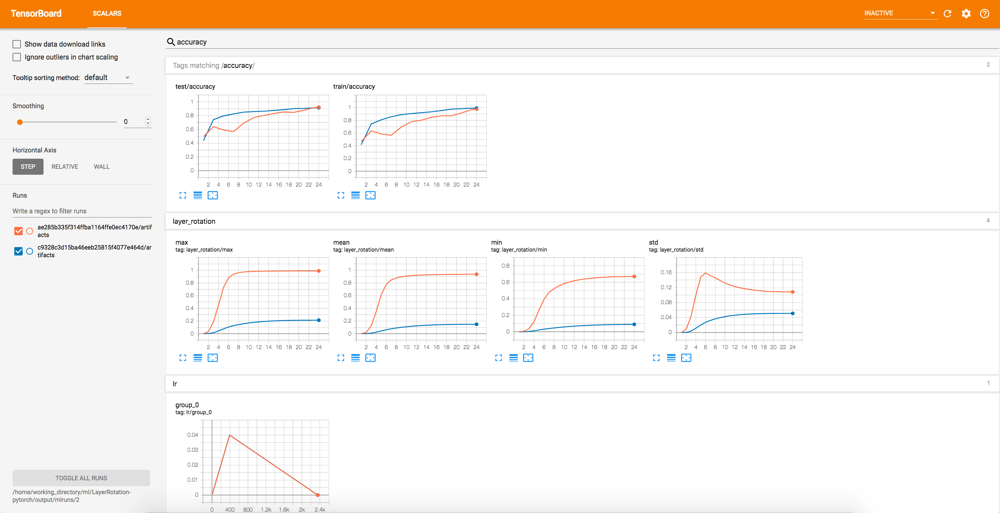

# Layer Rotation experiments in PyTorch

Experiments on "Layer Rotation" indicator and *Layca* applied on Cifar10 dataset.

Based on ["Layer rotation: a surprisingly powerful indicator of generalization in deep networks?"](https://arxiv.org/pdf/1806.01603v2.pdf) and paper's [code](https://github.com/ispgroupucl/layer-rotation-tools).

- Layer rotation monitoring (min/mean/max/std over all layers)
- LAYCA optimizers: 
  - [SGD](code/layca_optims/sgd.py)

**In my experiments, I didn't see any improvements of using LAYCA SGD optimizer. Use this code with caution!**

## Requirements

All experiments are run using [`pytorch-ignite`](https://github.com/pytorch/ignite.git) and [`mlflow`](https://github.com/mlflow/mlflow), please install the latest versions of these libraries
```
pip install --upgrade https://github.com/pytorch/ignite.git mlflow
```

## Experiments

### Start MLFlow UI server

Please create output folder (e.g. `$PWD/output`) and setup mlflow server:

```
export OUTPUT_PATH=/path/to/output
```
and 
```
mlflow server --backend-store-uri $OUTPUT_PATH/mlruns --default-artifact-root $OUTPUT_PATH/mlruns -p 5566 -h 0.0.0.0
```

MLflow dashboard is available in the browser at [0.0.0.0:5566](0.0.0.0:5566)

### CIFAR10 dataset

Create once "CIFAR10" experiment
```
export MLFLOW_TRACKING_URI=$OUTPUT_PATH/mlruns
mlflow experiments create -n CIFAR10
```

Start a single run

```
export MLFLOW_TRACKING_URI=$OUTPUT_PATH/mlruns
mlflow run experiments/ --experiment-name=CIFAR10 -P dataset=CIFAR10 -P network=fastresnet -P params="with_layca=True;data_path=../input/cifar10;lr_milestones_values=[(0, 0.0), (4, 1.0), (num_epochs, 0.0)]"
```

### Tensorboard 

All experiments are also logged to the Tensorboard. To visualize the experiments, please install `tensorboard` and run :
```
# tensorboard --logdir=$OUTPUT_PATH/mlruns/<experiment_id>
tensorboard --logdir=$OUTPUT_PATH/mlruns/1
```



